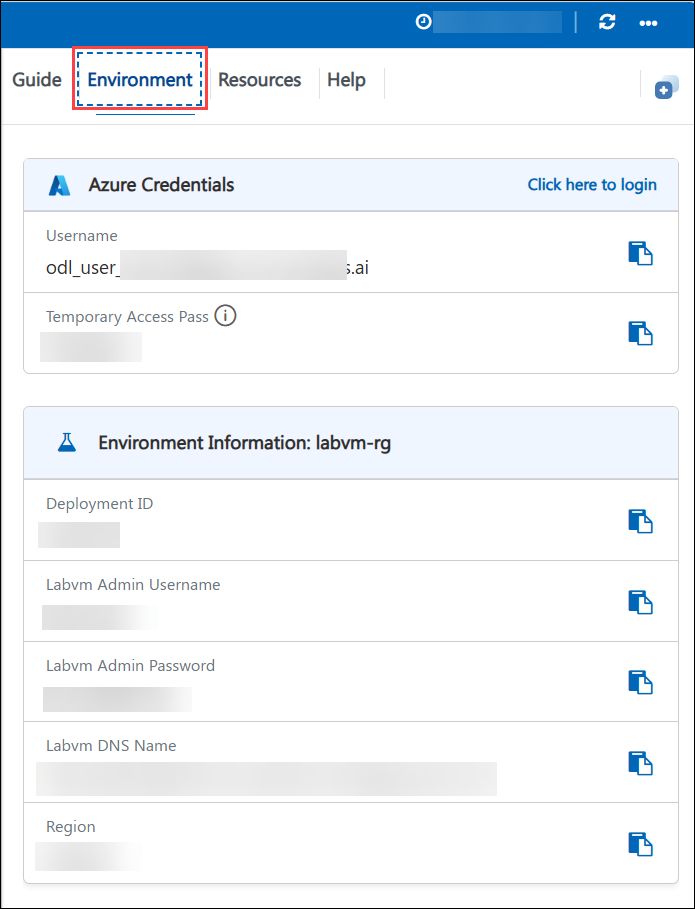
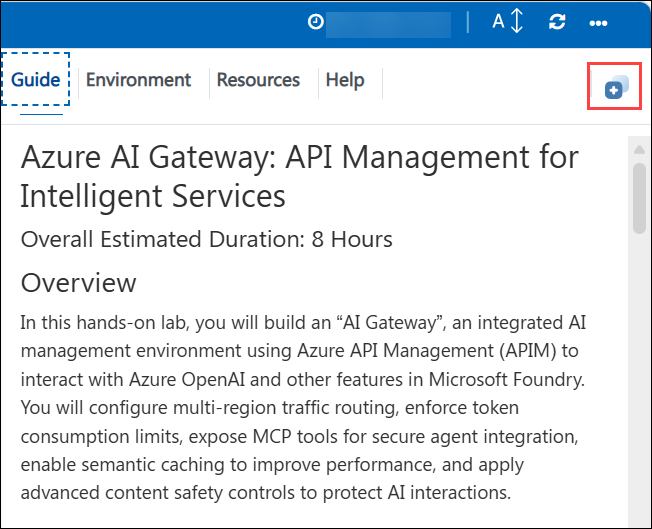

# Azure AI Gateway: API Management for Intelligent Services

### Overall Estimated Duration: 8 Hours

## Lab Scenario

Contoso Ltd. is implementing enterprise-scale AI solutions using Azure OpenAI and Microsoft Foundry services to enhance application intelligence. As AI adoption grows, the organization requires a centralized approach to securely manage, optimize, and govern AI workloads.

In this lab, you will act as an Azure AI Engineer at Contoso and build an **AI Gateway using Azure API Management (APIM)**. You will configure intelligent request routing, manage token usage, enable semantic caching for performance optimization, enforce content safety policies, and securely expose AI services.

By the end of this lab, you will have implemented a scalable, secure, and efficient AI management solution to support Contoso’s enterprise AI operations.

## Overview

In this hands-on lab, you will build an “AI Gateway”, an integrated AI management environment using Azure API Management (APIM) to interact with Azure OpenAI and other features in Microsoft Foundry. You will configure multi-region traffic routing, enforce token consumption limits, expose MCP tools for secure agent integration, enable semantic caching to improve performance, and apply advanced content safety controls to protect AI interactions.

## Objective 

This lab is designed to equip participants with hands-on experience in managing large-scale AI workloads through Azure API Management and the AI Gateway, configuring multi-region routing, monitoring, and governing token usage, integrating MCP-based tools, accelerating responses with semantic caching, and enforcing comprehensive content safety controls. Participants will deploy Azure OpenAI and Foundry resources, analyze telemetry with Application Insights, validate traffic flows using SDK-driven tests, and apply APIM policies to optimize, secure, and operationalize AI applications in an enterprise environment.

- **Load Balancing and Model Routing:** This lab guides participants through distributing LLM requests efficiently across multiple AI resources. Participants will learn to configure load balancing across AOAI resource pools, set up model routing to direct requests to specific models, and implement session affinity to maintain consistent AI agent interactions. 

- **Managing LLM Traffic**: This lab provides practical experience in monitoring and controlling LLM usage to optimize performance and reduce costs. Participants will capture token usage metrics, apply rate-limiting policies, and monitor consumption patterns to prevent overuse. 

- **Exposing MCP Tools via API Management**: Participants will explore securely exposing MCP servers and REST APIs through Azure API Management. This exercise focuses on centralized control, authentication, and secure API exposure. 

- **Semantic Caching for Performance Optimization**: 
This lab introduces participants to semantic caching to improve AI response times and reduce token consumption. Participants will learn caching principles and configure semantic caching in the AI Gateway environment. 

- **Content Safety & Filtering**: This exercise teaches participants to enforce content safety rules to ensure responsible AI interactions. Participants will configure filters for both inputs and outputs, apply enforcement rules, and monitor compliance.

## Prerequisites

Participants should have basic knowledge and understanding of the following:
 
 - Azure Portal
 - Microsoft Foundry Portal 

## Architecture

This architecture flow demonstrates the end-to-end lifecycle of operationalizing, securing, and optimizing AI services using Azure API Management. It begins with exposing Large Language Models (LLMs) and Model Context Protocol (MCP) servers through a centralized API gateway. Requests are routed efficiently using load balancing and model routing, while session affinity ensures consistent responses for agent interactions. Semantic caching reduces repeated AI requests, improving performance and lowering token consumption. Content safety and filtering policies enforce responsible AI interactions. Monitoring and telemetry track usage, token consumption, and performance metrics, while rate limiting and quotas optimize costs. Finally, secure API exposure and client authorization ensure that AI services are safely consumed, providing a scalable, cost-efficient, and compliant AI solution.

## Architecture Diagram

## Explanation of Components

- **Azure API Management (APIM):** Serves as the centralized gateway for exposing and managing AI services. APIM enforces security, policies, rate limits, and monitoring while providing a unified interface to consumers of AI services.

- **Large Language Models (LLMs):** AI models that handle natural language requests. LLMs are distributed across multiple instances for load balancing and routed based on the request type. Token usage is monitored to control operational costs.

- **Model Context Protocol (MCP) Servers:** Specialized AI tools or microservices exposed via APIs. MCP servers provide additional functionality and are secured through APIM with client authorization and controlled access.

- **Load Balancing & Model Routing:** Ensures AI requests are efficiently distributed across multiple LLM or MCP instances. Session affinity is maintained to provide consistent responses for conversational AI interactions.

- **Semantic Caching:** Stores previous AI responses for repeated or similar queries to reduce token consumption and improve response times.

- **Content Safety & Filtering:** Applies rules to screen user inputs and AI outputs, preventing unsafe or non-compliant interactions. Policies can be configured dynamically using request headers.

- **Monitoring & Telemetry:** Tracks token usage, request patterns, and performance metrics. Provides insights for optimizing AI workloads and controlling costs.

- **Rate Limiting & Quotas:** Controls AI traffic by setting limits on token consumption or API calls to prevent overspending and maintain reliable performance.

- **Client Authorization & Secure Access:** Ensures that only authorized users or applications can access MCP tools or LLM endpoints, maintaining secure and compliant AI operations.

## Getting Started with the Lab
 
Welcome to your Azure AI Gateway: API Management for Intelligent Services workshop! We've prepared a hands-on environment for you to explore and understand how Azure API Management can be leveraged to manage, secure, and optimize AI services, including Large Language Models (LLMs) and Model Context Protocol (MCP) servers.

## Accessing Your Lab Environment
 
Once you're ready to dive in, your virtual machine and **Guide** will be right at your fingertips within your web browser.

## Virtual Machine & Lab Guide

Your virtual machine is your workhorse throughout the workshop. The lab guide is your roadmap to success.

## Exploring Your Lab Resources

To get a better understanding of your lab resources and credentials, navigate to the **Environment** tab.

 

## Utilizing the Split Window Feature

For convenience, you can open the lab guide in a separate window by selecting the **Split Window** button from the Top right corner.

 

## Managing Your Virtual Machine

Feel free to **Start, Stop, or Restart (2)** your virtual machine as needed from the **Resources (1)** tab. Your experience is in your hands!

   

## Lab Guide Zoom In/Zoom Out

To adjust the zoom level for the environment page, click the **A↕** icon located next to the timer in the lab environment.

  

## Lab Validation

After completing the task, hit the **Validate** button under the Validation tab integrated within your lab guide. If you receive a success message, you can proceed to the next task; if not, carefully read the error message and retry the step, following the instructions in the lab guide.

## Support Contact

The CloudLabs support team is available 24/7, 365 days a year, via email and live chat to ensure seamless assistance at any time. We offer dedicated support channels tailored specifically for both learners and instructors, ensuring that all your needs are promptly and efficiently addressed.

  Learner Support Contacts:

   - Email Support: cloudlabs-support@spektrasystems.com
   - Live Chat Support: https://cloudlabs.ai/labs-support

Now, click on **Next >>** from the lower right corner to move on to the next page.

### Happy Learning!!

